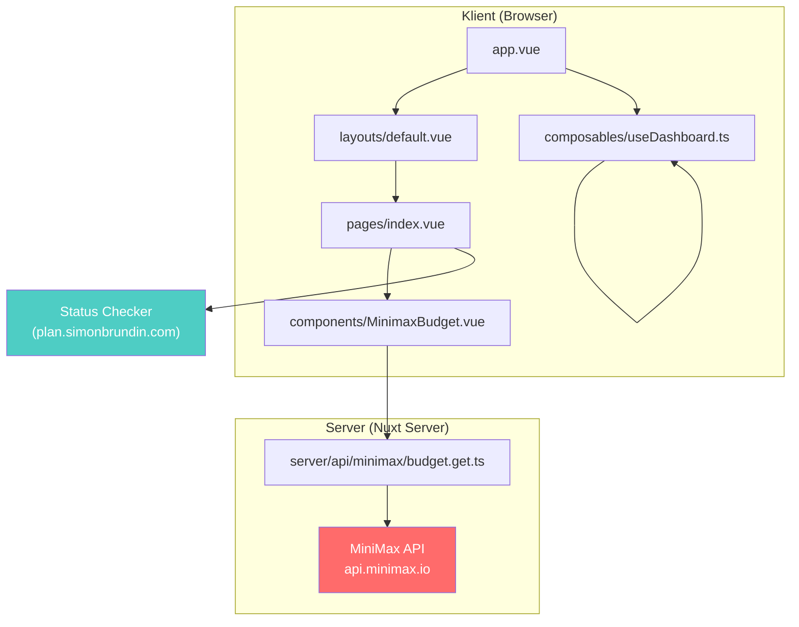
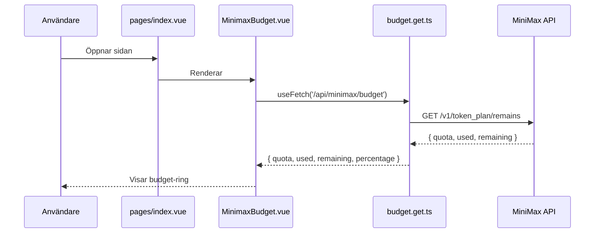

# Dashboard

## Arkitektur

### Dataflöde

## Beslut

Det här projektet använder **nub** som package manager i Nuxt i stället för
npm/yarn/pnpm.

## Idéer

- Få med Flux status
- Få med DORA metrics per applikation
- Få med Talos status
- Få med Longhorn status
